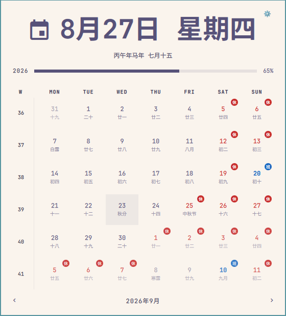
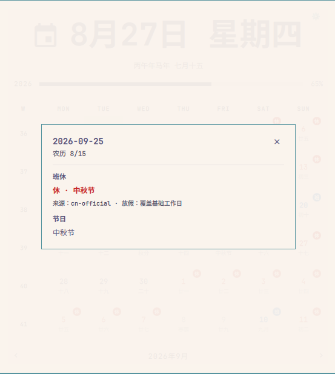
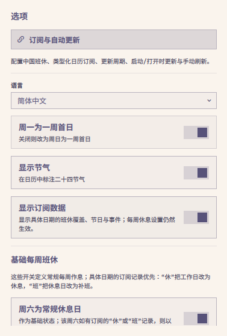
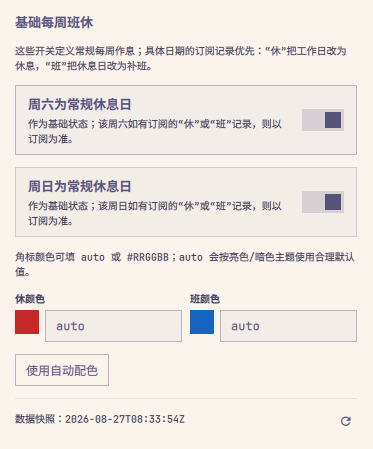
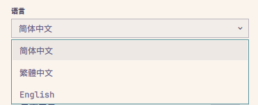
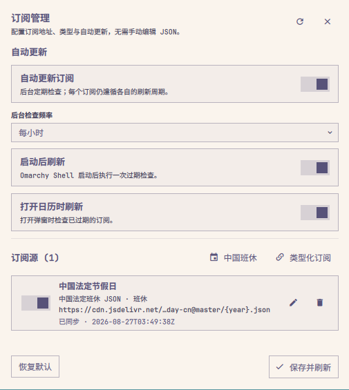

# Lunar Calendar for Omarchy

A drop-in replacement for the built-in Omarchy Clock bar widget that adds a
Chinese lunar calendar: lunar date, jieqi (二十四节气 / 24 solar terms), and
per-day lunar/festival captions in the month grid — in Simplified Chinese,
Traditional Chinese, or English.

Everything the Clock widget already does (month grid with ISO week numbers,
year-progress bar, memento-mori life bar, week-start toggle, right-click
format cycling, middle-click timezone picker) still works exactly the same;
this plugin adds lunar facts and typed subscription overlays on top.




## Features

- Lunar date and jieqi shown under the solar date, both in the bar's popup
  hero and as small captions under every day in the month grid.
- Bar label and hero date follow the plugin's own language setting instead
  of the system locale (so a Chinese UI language never falls back to English
  weekday/month names).
- Typed subscription overlays keep work schedules (`休` / `班`), cultural
  festivals, and calendar events in separate rendering channels.
- A canonical built-in festival catalog covers the seven mainland statutory
  observances: New Year's Day, Spring Festival, Qingming Festival, Labour Day,
  Dragon Boat Festival, Mid-Autumn Festival, and National Day, together with
  the existing traditional lunar observances.
- The fixed 6×7 month viewport treats all 42 visible dates as first-class
  calendar cells. Leading and trailing dates from adjacent months keep their
  `休` / `班` badges, festival captions, event dots, and click-through details;
  only visual emphasis is reduced.
- `休` and `班` colors support theme-aware `auto` defaults or custom
  `#RRGGBB` values; badge text contrast is selected automatically.
- Saturday/Sunday settings define the base weekly work/rest schedule. A
  date-specific subscribed `休` or `班` record takes precedence, so `班`
  correctly cancels a regular rest day for make-up work.
- Subscription snapshots refresh outside the long-lived shell and fall back to
  the last known-good data when a source fails.
- Omarchy's native Widget Settings now exposes the official holiday URL,
  automatic-update policy, and refresh intervals. A built-in advanced manager
  can still add, edit, enable, disable, or remove multiple typed sources.
- The top-right **Settings** gear opens all calendar options:
  - **Language** — Simplified Chinese, Traditional Chinese, or English.
    Defaults to whatever your system locale implies (`zh_CN`-family ->
    Simplified, `zh_TW`/`zh_HK`/`zh_MO` -> Traditional, otherwise English).
  - **Week starts on Monday** — toggles the calendar between a
    Monday-first and Sunday-first week (same toggle the "W" column header
    already offered, just made visible as an explicit option).
  - **Show solar terms** — toggles the jieqi caption on/off.
  - **Subscriptions and automatic updates** — the first settings item opens the advanced source manager.

<p float="left">
  
  
  
</p>

## Subscription scope

China's statutory holiday and make-up-work schedule cannot be derived from the
lunar calendar, so it is handled as refreshable subscription data instead of
being hard-coded into the calendar algorithm. The built-in adapter consumes
structured `holiday-cn` JSON and keeps a last-known-good local snapshot. A
next-year file that has not been published yet is reported as pending rather
than treated as a broken source.

The first subscription release intentionally supports structured JSON only. A
generic ICS feed is treated as a future, dedicated adapter because correct ICS
support requires UID/recurrence, time-zone, all-day, and exception semantics;
event titles are never guessed to mean `休` or `班`.



## Installation

```
omarchy plugin add https://github.com/laojianzi/omarchy_chinese_lunar_calendar.git --enable
```

Or clone and edit locally:

```
git clone https://github.com/laojianzi/omarchy_chinese_lunar_calendar.git \
  ~/.config/omarchy/plugins/garyliu.lunar-calendar
omarchy plugin enable garyliu.lunar-calendar --section center
```

The manifest declares this widget as a replacement for `omarchy.clock`, so
Omarchy preserves the clock's bar position and routes the existing calendar
shortcut to this plugin when it is enabled.

### Subscription controls are missing

Earlier documentation pointed at the original upstream repository, which does
not contain this fork's subscription UI. Verify the installed checkout:

```bash
git -C ~/.config/omarchy/plugins/garyliu.lunar-calendar remote get-url origin
git -C ~/.config/omarchy/plugins/garyliu.lunar-calendar rev-parse --short HEAD
```

The origin should be `laojianzi/omarchy_chinese_lunar_calendar`. To switch an
existing checkout and update it:

```bash
git -C ~/.config/omarchy/plugins/garyliu.lunar-calendar remote set-url origin \
  https://github.com/laojianzi/omarchy_chinese_lunar_calendar.git
omarchy plugin update garyliu.lunar-calendar --yes
```

Reopen the panel after the plugin reload. Open the top-right gear; the settings
page starts with **Subscriptions and automatic updates**.

## Removal

```
omarchy plugin remove garyliu.lunar-calendar
```

Removing the active replacement restores the built-in Clock widget.

## Typed subscriptions

The plugin now separates transport from calendar semantics. Every remote source
is normalized into one of three record kinds before QML sees it:

- `schedule` — official day-off or make-up-work status; rendered as `休` / `班`
  and used to compute the effective workday style.
- `festival` — a cultural label; rendered in the caption layer and never
  interpreted as a day off on its own.
- `event` — a timed or all-day occurrence; rendered as dots in the month grid
  and listed in the per-day details overlay.

Work/rest state is projected in two stages:

1. `saturdayIsRest` and `sundayIsRest` establish the ordinary weekly baseline.
2. A date-specific subscribed `schedule` record is applied afterwards and wins.
   `off` changes the effective date to `休`; `work` changes it to `班`. A `work`
   record on a base rest day is therefore a real make-up workday, not a weekend
   setting that can be overwritten locally.

### Festival observance versus holiday schedule

A `schedule` record and a `festival` record answer different product questions:

- `schedule` says whether a specific civil date is worked or rested. A holiday
  schedule can cover several dates and can also contain a weekend make-up day.
- `festival` identifies the actual observance date. It does not imply that the
  date is off work by itself.

The projection layer therefore adds deterministic built-in festival records for
fixed Gregorian observances (January 1, May 1, and October 1), Qingming on the
actual Qingming solar-term date, and the existing lunar rules. On October 1 the
detail panel can correctly show both `休` and `国庆节`; on October 2 it shows the
`国庆节` holiday schedule but does not falsely claim that October 2 is National
Day. The schedule section labels such dates as related holiday-period dates.

Subscribed festival records with the same canonical `festivalId` are deduplicated
against the built-in record while source provenance is retained. The details
panel shows each festival's category, calendar basis, and source separately from
the work/rest source.

### Month viewport semantics

A month page is a 42-date viewport, not a filter that owns only the numbered
month. Projection, work/rest resolution, festival merging, and event lookup run
for every visible date key, including the previous-month and next-month cells at
the edges of the grid.

`inMonth` is therefore presentation metadata only. Current-month cells use full
emphasis; adjacent-month cells are dimmed, while semantic indicators remain
visible at a stronger opacity so a cross-month `班`, `休`, conflict, or event is
never silently hidden. Clicking an adjacent-month cell opens the same full date
details as any other cell.

The default source uses `holiday-cn-json`. A second adapter,
`calendar-feed-v1`, accepts an explicitly typed JSON feed for schedules,
festivals, and events. Generic ICS is intentionally not guessed from event
summaries; it should be added through a dedicated adapter that preserves UID,
recurrence, time-zone, and all-day semantics.

Use Omarchy's native Widget Settings for the official holiday URL, automatic
update policy, Saturday/Sunday base rest days, and `休` / `班` colors. The same
weekly-baseline and color controls are available in the calendar's gear menu.
Date-specific subscribed `休` / `班` records always take precedence. For
multiple sources, open the calendar, click the top-right gear, and select
**Subscriptions and automatic updates**, which is pinned as the first settings
item. The IPC method `garyliu.lunar-calendar subscriptions` remains available
for automation. The advanced settings UI supports:

- the built-in China statutory holiday preset;
- custom `calendar-feed-v1` HTTPS or local-file addresses;
- source name, stable ID, adapter, priority, refresh period, and enable state;
- automatic updates, background-check frequency, startup refresh, and
  refresh-on-open;
- last-success, pending-next-year, cached-data, partial, and error status;
- manual refresh and a two-step restore-defaults action.

The same configuration can still be managed as JSON for dotfiles or scripted
installs. Start from [`examples/subscriptions.json`](examples/subscriptions.json)
when doing so.

## Recommended public sources

These feeds are maintained by community projects rather than by a government
subscription service. Their maintainers derive the holiday schedule from State
Council notices, but any third-party endpoint can be delayed, changed, or
retired. Keep automatic updates and last-known-good fallback enabled, and review
the linked upstream project before relying on a feed.

### Directly supported by this plugin

#### `NateScarlet/holiday-cn` — recommended default

[`holiday-cn`](https://github.com/NateScarlet/holiday-cn) publishes structured
JSON containing the holiday name, ISO date, `isOffDay` value, and source notice
URLs. It is the best match for the plugin's typed `schedule` model because
`休` and `班` are represented as data rather than inferred from an event title.
The built-in **China statutory holiday** preset already uses its jsDelivr
address.

Use adapter `holiday-cn-json` with this URL template. Keep the literal
`{year}` placeholder; the synchronizer requests the previous, current, and next
year as needed.

```text
https://cdn.jsdelivr.net/gh/NateScarlet/holiday-cn@master/{year}.json
```

GitHub Raw fallback:

```text
https://raw.githubusercontent.com/NateScarlet/holiday-cn/master/{year}.json
```

The project also publishes a compact ICS feed for conventional calendar apps:

```text
https://cdn.jsdelivr.net/gh/NateScarlet/holiday-cn@master/holiday-cn.ics
```

### Popular ICS feeds for Apple, Google Calendar, and Outlook

**The current plugin does not parse ICS. Do not paste the following addresses
into the plugin's source editor yet.** Subscribe to them in an external calendar
client using a URL subscription, not a one-time file import. They are listed
here because users often want the same China holiday data on desktop and mobile
while the dedicated ICS adapter is still planned.

#### ShuYZ China holiday calendar

[`lanceliao/china-holiday-calender`](https://github.com/lanceliao/china-holiday-calender)
is a widely used feed with separate variants for all dates, holidays only, and
make-up workdays only. Its full feed represents make-up work as timed work
appointments and may include reminders, which is useful for users who want
补班 notifications.

Full holiday + make-up-work feed:

```text
https://cdn.jsdelivr.net/gh/lanceliao/china-holiday-calender/holidayCal.ics
```

Holiday-only and make-up-work-only variants:

```text
https://cdn.jsdelivr.net/gh/lanceliao/china-holiday-calender/holidayCal-HO.ics
https://cdn.jsdelivr.net/gh/lanceliao/china-holiday-calender/holidayCal-CO.ics
```

Maintainer-hosted China-accessible endpoint:

```text
https://www.shuyz.com/githubfiles/china-holiday-calender/master/holidayCal.ics
```

#### `vsme/chinese-days`

[`chinese-days`](https://github.com/vsme/chinese-days) publishes holiday and
make-up-work data together with developer-facing JSON, lunar-calendar, and solar
term utilities. Its ICS feed contains recent years and is intended for Apple
Calendar, Google Calendar, and Microsoft Outlook.

Chinese feed:

```text
https://cdn.jsdelivr.net/npm/chinese-days/dist/holidays.ics
```

English feed:

```text
https://cdn.jsdelivr.net/npm/chinese-days/dist/holidays.en.ics
```

Its JSON files use a different schema from `holiday-cn-json`; they will require
a dedicated adapter before they can be selected directly in this plugin.

Runtime files are kept outside the plugin checkout:

```text
~/.config/omarchy/lunar-calendar/subscriptions.json
~/.cache/omarchy/lunar-calendar/snapshot-v1.json
~/.local/state/omarchy/lunar-calendar/sync-state.json
```

The sync helper performs bounded HTTPS downloads, schema validation,
last-known-good fallback, per-source status reporting, and atomic snapshot
replacement. Subscription URLs are stored in the user config with mode `0600`;
the settings UI sends updates to the helper over stdin so private feed tokens do
not appear in `shell.json` or process arguments. The long-lived Omarchy shell
only watches the canonical config and snapshot.

The subscription helper requires Python 3. Manual refresh and diagnostics:

```bash
python3 ~/.config/omarchy/plugins/garyliu.lunar-calendar/bin/calendar-subscription-sync --force
python3 ~/.config/omarchy/plugins/garyliu.lunar-calendar/bin/calendar-subscription-sync --print-config
```

A validated config can also be written non-interactively over stdin:

```bash
jq -c . subscriptions.json | \
  python3 ~/.config/omarchy/plugins/garyliu.lunar-calendar/bin/calendar-subscription-sync \
    --write-config-stdin --quiet
```

The source configuration and canonical feed schemas are documented in
[`schemas/subscriptions-v1.schema.json`](schemas/subscriptions-v1.schema.json)
and [`schemas/calendar-feed-v1.schema.json`](schemas/calendar-feed-v1.schema.json).

## Credits

The lunar calendar algorithm (the 1900–2100 lunar year-info table and the
jieqi/solar-term calculation) is adapted from the MIT-licensed
[tigertall/chinese-calendar](https://github.com/tigertall/chinese-calendar)
GNOME Shell extension, rewritten to run in plain QML JavaScript.

## License

MIT — see [LICENSE](LICENSE).
